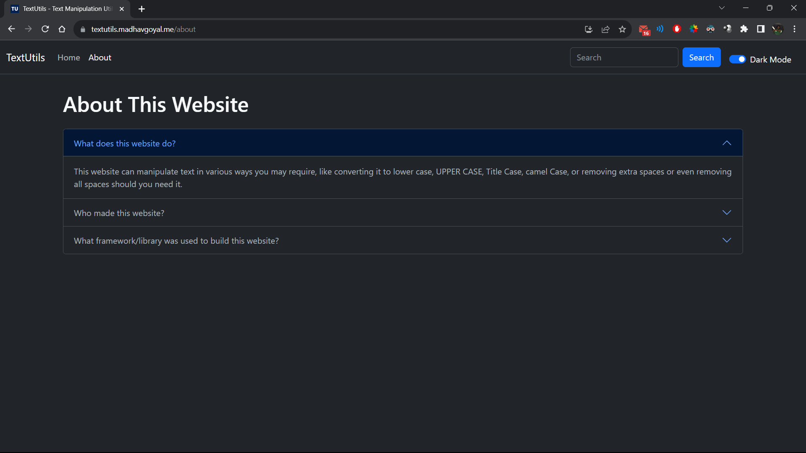

# TextUtils - Text Manipulation Utility Web App

## Responsive web-app to quickly manipulate text content and get useful summary about it.

### Screenshots:

Dark theme:

Light Theme:

Text Manipulation and Alerts:

Text Summary and Copy to Clipboard:

About Page:

---

### The feature list is as follows:

- Convert to Upper Case
- Convert to Lower Case
- Convert to Title Case
- Convert to Camel Case
- Remove Extra Spaces
- Remove All Spaces
- Copy to Clipboard
- View Word and Character Count
- Approximate time required to read the text

---

### Technologies used:

- React - JavaScript Front-End Library
- Create React App - React Framework to create React project quickly and easily
- React Router DOM - routing library for React applications to navigate between different pages
- Bootstrap - Front-End Framework with reusable HTML, CSS and JavaScript code

---

### The following Bootstrap components have been used:

- Navbar - at the top
- Switch - in right side of Navbar to switch between Light and Dark Theme
- Textarea - in middle of page to enter text
- Buttons - right under the Textarea to manipulate text
- Alert - shown at top for 3 seconds after clicking any button
- Accordian - on About page to view info about website

---

### App is hosted at [https://textutils.madhavgoyal.me/](https://textutils.madhavgoyal.me/ "Visit website") for easy access anytime and anywhere.

---

---

This project was bootstrapped with [Create React App](https://github.com/facebook/create-react-app).

## Few Useful Scripts

In the project directory, you can run:

### `npm start`

Runs the app in the development mode.
Open [http://localhost:3000](http://localhost:3000) to view it in your browser.

The page will reload when you make changes.
You may also see any lint errors in the console.

### `npm run build`

Builds the app for production to the `build` folder.
It correctly bundles React in production mode and optimizes the build for the best performance.

The build is minified and the filenames include the hashes.
Your app is ready to be deployed!
